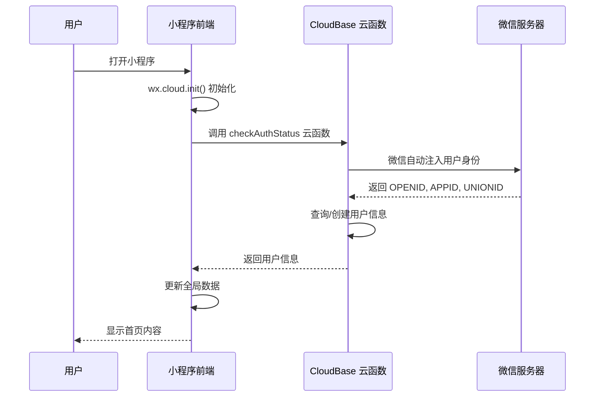

# 项目架构文档 - Baby Care Tracker

## 概述

Baby Care Tracker 是一款基于微信小程序的宝宝照片记录工具，采用 CloudBase 全栈云服务架构。项目使用原生微信小程序 + CloudBase 云开发，无需自建后端服务器。

**核心特性：**
- 安全存储：宝宝照片云端存储，不占用手机空间
- 家庭共享：家庭成员共同记录和回顾宝宝成长
- 时间轴回顾：按年/月/日分类查看照片

---

## 项目结构

```
成长日记/
├── miniprogram/              # 微信小程序前端
│   ├── components/          # 组件目录（当前为空，组件内联在页面中）
│   ├── models/             # 数据模型
│   ├── pages/              # 页面目录
│   │   ├── index/         # 首页（照片瀑布流）
│   │   ├── baby-profile/  # 宝宝档案列表
│   │   ├── baby-edit/     # 创建/编辑宝宝档案
│   │   ├── photo-upload/  # 上传照片
│   │   ├── photo-browse/  # 浏览照片（瀑布流）
│   │   ├── photo-detail/  # 照片详情
│   │   ├── photo-time/     # 按时间查看照片
│   │   ├── family-members/ # 家庭成员管理
│   │   ├── accept-invitation/ # 接受邀请
│   │   ├── recycle-bin/   # 回收站
│   │   └── profile/       # 个人中心
│   ├── services/           # 服务层（云函数调用封装）
│   │   ├── babyService.js
│   │   ├── photoService.js
│   │   └── userService.js
│   ├── utils/              # 工具函数
│   │   ├── cloudUtil.js    # 云函数调用封装
│   │   ├── dateUtil.js     # 日期处理
│   │   ├── errorUtil.js    # 错误处理
│   │   └── fileUtil.js     # 文件处理
│   ├── app.js              # 小程序入口
│   ├── app.json            # 小程序配置
│   └── app.wxss            # 全局样式
│
├── cloudfunctions/          # CloudBase 云函数
│   ├── checkAuthStatus/   # 检查认证状态（获取/创建用户）
│   ├── createBabyProfile/  # 创建宝宝档案
│   ├── getBabyProfiles/   # 获取宝宝档案列表
│   ├── uploadPhoto/       # 上传照片
│   ├── getPhotos/         # 获取照片列表
│   ├── getPhotoDetail/    # 获取照片详情
│   ├── updatePhoto/       # 更新照片信息
│   ├── deletePhoto/       # 删除照片（移入回收站）
│   ├── getDeletedPhotos/   # 获取已删除照片
│   ├── restorePhoto/      # 恢复照片
│   ├── getFamilyMembers/  # 获取家庭成员列表
│   ├── inviteMember/      # 邀请家庭成员
│   ├── acceptInvitation/  # 接受邀请
│   ├── removeMember/      # 移除家庭成员
│   └── auditPhoto/       # 内容审核
│
├── specs/                  # 需求与设计文档
│   └── baby-photo-app/
│       ├── requirements.md  # 需求文档
│       ├── design.md        # 设计文档
│       └── tasks.md         # 任务清单
│
├── scripts/                # 脚本工具
├── project.config.json    # 微信开发者工具配置
├── cloudbaserc.json      # CloudBase CLI 配置
└── package.json          # 项目依赖
```

---

## 技术栈

| 层级 | 技术选型 | 说明 |
|------|---------|------|
| **前端** | 微信小程序原生框架 | 使用微信开发者工具，原生开发 |
| **后端云服务** | CloudBase（腾讯云开发） | 云函数、数据库、存储、鉴权全托管 |
| **数据库** | CloudBase 数据库（NoSQL 文档数据库） | 类似 MongoDB 的文档数据库 |
| **文件存储** | CloudBase 存储（基于 COS） | 宝宝照片、头像等文件存储 |
| **认证方式** | CloudBase 微信小程序自动认证 | 无需手动登录，认证自动完成 |
| **内容审核** | CloudBase 内容安全 API | AI 自动审核图片和文本 |

---

## 认证架构（CloudBase 微信小程序自动认证）

### 认证流程



### 关键要点

1. **无需手动登录**：CloudBase 微信小程序认证是自动完成的，用户使用小程序时自动完成认证
2. **身份自动注入**：云函数中通过 `cloud.getWXContext()` 获取用户身份（OPENID, APPID, UNIONID）
3. **OPENID 是核心标识**：使用 OPENID 作为用户唯一标识，存入数据库关联用户数据
4. **无需登录页面**：应用启动后直接进入首页，在后台静默完成用户认证

### 代码实现

**小程序端（app.js）：**
```javascript
// app.js
App({
  onLaunch: function () {
    // 初始化 CloudBase
    wx.cloud.init({
      env: 'neo3-7gtg0bdtc9fcc672',
      traceUser: true
    })
    
    // 异步检查登录状态，不阻塞启动流程
    this.checkLoginStatusAsync()
  },
  
  checkLoginStatusAsync: function () {
    wx.cloud.callFunction({
      name: 'checkAuthStatus',
      success: (res) => {
        if (res.result && res.result.code === 0) {
          this.globalData.userInfo = res.result.data
          this.globalData.isLoggedIn = true
          
          if (this.onLoginStateChange) {
            this.onLoginStateChange(true)
          }
        }
      },
      fail: (err) => {
        console.error('检查登录状态失败:', err)
      }
    })
  },
  
  globalData: {
    userInfo: null,
    isLoggedIn: false,
    currentBaby: null
  }
})
```

**云函数端（checkAuthStatus）：**
```javascript
// cloudfunctions/checkAuthStatus/index.js
const cloud = require('wx-server-sdk')
cloud.init({ env: cloud.DYNAMIC_CURRENT_ENV })

exports.main = async (event, context) => {
  // 获取用户身份 - 由微信自动注入
  const { OPENID, APPID } = cloud.getWXContext()
  
  if (!OPENID) {
    return { code: -1, message: '获取用户身份失败' }
  }
  
  // 查询用户信息
  const userResult = await db.collection('users').where({
    _openid: OPENID
  }).get()
  
  let user = null
  if (userResult.data.length > 0) {
    user = userResult.data[0]
  } else {
    // 用户不存在，创建新用户
    const newUser = {
      _openid: OPENID,
      appId: APPID,
      nickName: '',
      avatarUrl: '',
      babyProfiles: [],
      createTime: db.serverDate(),
      updateTime: db.serverDate()
    }
    
    const addResult = await db.collection('users').add(newUser)
    user = { _id: addResult._id, ...newUser }
  }
  
  return { code: 0, message: '获取用户信息成功', data: user }
}
```

---

## 核心模块

### 1. 小程序前端

#### 页面结构

| 页面 | 路径 | 功能描述 |
|------|------|---------|
| 首页 | `pages/index/index` | 照片瀑布流，快速操作入口 |
| 宝宝档案 | `pages/baby-profile/baby-profile` | 宝宝档案列表和管理 |
| 创建/编辑宝宝 | `pages/baby-edit/baby-edit` | 创建或编辑宝宝档案 |
| 上传照片 | `pages/photo-upload/photo-upload` | 上传宝宝照片 |
| 浏览照片 | `pages/photo-browse/photo-browse` | 照片瀑布流浏览 |
| 照片详情 | `pages/photo-detail/photo-detail` | 照片详情查看 |
| 按时间查看 | `pages/photo-time/photo-time` | 按年/月/日分类查看 |
| 家庭成员 | `pages/family-members/family-members` | 家庭成员管理 |
| 接受邀请 | `pages/accept-invitation/accept-invitation` | 接受家庭成员邀请 |
| 回收站 | `pages/recycle-bin/recycle-bin` | 已删除照片恢复 |
| 个人中心 | `pages/profile/profile` | 用户信息和管理 |

#### TabBar 配置

```json
{
  "tabBar": {
    "list": [
      { "pagePath": "pages/index/index", "text": "首页" },
      { "pagePath": "pages/photo-browse/photo-browse", "text": "照片" },
      { "pagePath": "pages/profile/profile", "text": "我的" }
    ]
  }
}
```

### 2. 服务层（services/）

服务层封装了云函数调用，提供统一的 API 接口。

| 服务文件 | 功能描述 |
|---------|---------|
| `userService.js` | 用户相关服务（获取用户信息、更新用户信息、检查登录状态） |
| `babyService.js` | 宝宝档案服务（获取档案列表、创建档案、更新档案、删除档案） |
| `photoService.js` | 照片服务（上传照片、获取照片列表、获取照片详情、更新照片、删除照片） |

### 3. 工具层（utils/）

工具层提供了通用的工具函数。

| 工具文件 | 功能描述 |
|---------|---------|
| `cloudUtil.js` | 云函数调用封装（callCloudFunction、uploadFile、downloadFile、getTempFileURL） |
| `dateUtil.js` | 日期处理工具（格式化日期、计算年龄等） |
| `errorUtil.js` | 错误处理工具（统一错误处理和用户提示） |
| `fileUtil.js` | 文件处理工具（文件压缩、路径生成等） |

### 4. CloudBase 云函数

云函数实现了后端业务逻辑。

| 云函数 | 功能描述 |
|--------|---------|
| `checkAuthStatus` | 检查认证状态，获取或创建用户信息 |
| `createBabyProfile` | 创建宝宝档案 |
| `getBabyProfiles` | 获取用户的宝宝档案列表 |
| `uploadPhoto` | 上传照片到 CloudBase 存储 |
| `getPhotos` | 获取照片列表（分页+筛选） |
| `getPhotoDetail` | 获取照片详情 |
| `updatePhoto` | 更新照片信息（描述、标签等） |
| `deletePhoto` | 删除照片（移入回收站） |
| `getDeletedPhotos` | 获取已删除照片列表 |
| `restorePhoto` | 恢复已删除照片 |
| `getFamilyMembers` | 获取家庭成员列表 |
| `inviteMember` | 邀请家庭成员 |
| `acceptInvitation` | 接受家庭成员邀请 |
| `removeMember` | 移除家庭成员 |
| `auditPhoto` | 内容审核（AI 自动或人工） |

---

## 数据流

### 1. 用户认证数据流

```
用户打开小程序
  ↓
app.js onLaunch
  ↓
wx.cloud.init() 初始化 CloudBase
  ↓
checkLoginStatusAsync() 异步检查登录状态
  ↓
调用云函数 checkAuthStatus
  ↓
云函数中 cloud.getWXContext() 获取 OPENID
  ↓
查询/创建用户信息
  ↓
返回用户信息到小程序端
  ↓
更新 globalData.userInfo 和 globalData.isLoggedIn
  ↓
触发 onLoginStateChange 回调
  ↓
页面接收到登录状态变更，加载数据
```

### 2. 照片上传数据流

```
用户选择照片
  ↓
photo-upload 页面调用 photoService.uploadPhoto()
  ↓
云函数 uploadPhoto 处理上传
  ↓
照片文件存储到 CloudBase 存储
  ↓
照片元数据保存到 CloudBase 数据库
  ↓
触发内容审核（AI 自动审核）
  ↓
返回上传结果
  ↓
前端显示上传成功，刷新照片列表
```

### 3. 照片浏览数据流

```
用户进入 photo-browse 页面
  ↓
页面 onLoad 调用 photoService.getPhotos()
  ↓
云函数 getPhotos 查询数据库
  ↓
返回照片列表（包含临时访问 URL）
  ↓
前端渲染照片瀑布流
  ↓
用户滚动，触发分页加载更多照片
```

---

## 性能优化策略

### 1. 前端性能优化

- **图片懒加载**：使用 `wx.getImageInfo` 预加载可见区域图片
- **虚拟列表**：照片瀑布流使用虚拟列表优化，保持帧率 > 50fps
- **分页加载**：照片列表使用分页加载，每次加载 20 张照片
- **缓存策略**：用户信息、宝宝档案等数据缓存到全局变量，减少云函数调用

### 2. 后端性能优化

- **数据库索引**：为常用查询字段创建索引（babyId, createdAt, uploaderId 等）
- **云函数超时配置**：上传照片云函数超时时间设置为 60 秒
- **存储 CDN 加速**：CloudBase 存储默认 CDN 域名，加速图片访问

---

## 安全策略

### 1. 认证安全

- **CloudBase 自动认证**：依赖微信自动注入的用户身份，无需手动管理登录态
- **OPENID 验证**：云函数中通过 `cloud.getWXContext()` 获取 OPENID，确保身份可信

### 2. 数据安全

- **数据库安全规则**：使用 CloudBase 数据库安全规则，防止越权访问
- **存储权限控制**：CloudBase 存储使用私有读权限，通过签名 URL 临时授权访问

### 3. 内容安全

- **AI 自动审核**：所有用户上传内容（照片、文本）必须经过 AI 审核
- **审核不通过处理**：审核不通过的内容自动删除，并通知用户

---

## 部署与发布

### 1. 开发环境

- **CloudBase 环境 ID**：`neo3-7gtg0bdtc9fcc672`
- **微信小程序 AppID**：`wx1f1bc8e6ff2be61d`

### 2. 部署流程

1. **部署云函数**：使用 CloudBase CLI 或微信开发者工具部署云函数
2. **上传小程序代码**：使用微信开发者工具上传小程序代码
3. **提交审核**：在微信公众平台提交小程序审核
4. **发布上线**：审核通过后发布上线

---

## 版本历史

| 版本 | 日期 | 描述 |
|------|------|------|
| v0.1 | 2026-05-21 | 初始版本，实现 MVP 功能（微信登录、宝宝档案、照片上传、照片浏览） |

---

## 后续规划

### V1.0（P1 功能）

- 家庭成员管理
- 权限管理
- 照片下载
- 内容审核（AI 自动）
- Web 运营后台

### V2.0（P2 功能）

- 商业化（付费存储、付费功能）
- 高级编辑功能（照片编辑、视频记录）
- 社交功能（评论、点赞、分享）

---

**文档版本**：v1.0  
**最后更新**：2026-05-21  
**维护者**：开发团队
