# 项目架构文档 - Baby Care Tracker

## 概述

Baby Care Tracker 是一款基于微信小程序的宝宝照片记录工具，采用 CloudBase 全栈云服务架构。项目使用原生微信小程序 + CloudBase 云开发，无需自建后端服务器。

**核心特性：**
- 安全存储：宝宝照片云端存储，不占用手机空间
- 家庭共享：家庭成员共同记录和回顾宝宝成长
- 时间轴回顾：按年/月/日分类查看照片

---

## 项目结构

```
成长日记/
├── miniprogram/              # 微信小程序前端
│   ├── components/             # 可复用组件（ui-hero、status-card、action-card、empty-state-panel 等）
│   ├── assets/
│   │   └── icons/
│   │       └── lucide/         # 由脚本生成的 PNG 图标资源与 manifest
│   ├── models/                 # 数据模型
│   ├── pages/                  # 页面目录
│   │   ├── index/              # 首页（照片瀑布流）
│   │   ├── baby-profile/       # 宝宝档案列表
│   │   ├── baby-edit/          # 创建宝宝档案
│   │   ├── photo-upload/       # 上传照片
│   │   ├── photo-browse/       # 浏览照片（瀑布流）
│   │   ├── photo-detail/       # 照片详情
│   │   ├── photo-time/         # 按时间查看照片
│   │   ├── family-members/     # 家庭成员管理
│   │   ├── accept-invitation/  # 接受邀请
│   │   ├── recycle-bin/        # 回收站
│   │   ├── feedback/           # 意见反馈
│   │   ├── profile/            # 个人工作台
│   │   └── profile-edit/       # 完善个人资料
│   ├── services/               # 服务层（云函数调用封装）
│   │   ├── userService.js
│   │   ├── babyService.js
│   │   ├── familyService.js
│   │   └── photoService.js
│   ├── utils/                  # 工具函数
│   │   ├── cloudUtil.js        # 云函数调用封装
│   │   ├── dateUtil.js         # 日期处理
│   │   ├── errorUtil.js        # 错误处理
│   │   └── mockStore.js        # 本地兜底数据
│   ├── app.js                  # 小程序入口
│   ├── app.json                # 小程序配置
│   └── app.wxss                # 全局样式
│
├── cloudfunctions/             # CloudBase 云函数
│   ├── _shared/                # 共享鉴权与 DB 能力
│   ├── checkAuthStatus/        # 检查认证状态（获取/创建用户）
│   ├── updateUserProfile/      # 更新个人资料
│   ├── createBabyProfile/      # 创建宝宝档案
│   ├── getBabyProfiles/        # 获取宝宝档案列表
│   ├── uploadPhoto/            # 上传照片
│   ├── getPhotos/              # 获取照片列表
│   ├── getPhotoDetail/         # 获取照片详情
│   ├── deletePhoto/            # 删除照片（移入回收站）
│   ├── getDeletedPhotos/       # 获取已删除照片
│   ├── restorePhoto/           # 恢复照片
│   ├── getFamilyMembers/       # 获取家庭成员列表
│   ├── inviteMember/           # 邀请家庭成员
│   ├── acceptInvitation/       # 接受邀请
│   └── removeMember/           # 移除家庭成员
│
├── scripts/
│   └── generate-lucide-icons.js # Lucide SVG -> 小程序 PNG 图标生成脚本
├── project.config.json         # 微信开发者工具配置
├── cloudbaserc.json            # CloudBase CLI 配置
└── package.json                # 项目依赖与工程脚本
```

---

## 技术栈

| 层级 | 技术选型 | 说明 |
|------|---------|------|
| **前端** | 微信小程序原生框架 | 使用微信开发者工具，原生开发 |
| **后端云服务** | CloudBase（腾讯云开发） | 云函数、数据库、存储、鉴权全托管 |
| **数据库** | CloudBase 数据库（NoSQL 文档数据库） | 类似 MongoDB 的文档数据库 |
| **文件存储** | CloudBase 存储（基于 COS） | 宝宝照片、头像等文件存储 |
| **认证方式** | CloudBase 微信小程序自动认证 | 无需手动登录，认证自动完成 |
| **内容审核** | CloudBase 内容安全 API | AI 自动审核图片和文本 |

---

## 认证架构（CloudBase 微信小程序自动认证）

### 认证流程

```mermaid
sequenceDiagram
    participant U as 用户
    participant M as 小程序前端
    participant CF as CloudBase 云函数
    participant WX as 微信服务器
    
    U->>M: 打开小程序
    M->>M: wx.cloud.init() 初始化
    M->>CF: 调用 checkAuthStatus 云函数
    CF->>WX: 微信自动注入用户身份
    WX-->>CF: 返回 OPENID, APPID, UNIONID
    CF->>CF: 查询/创建用户信息
    CF-->>M: 返回用户信息
    M->>M: 更新全局数据
    M-->>U: 显示首页内容
```



### 关键要点

1. **无需手动登录**：CloudBase 微信小程序认证是自动完成的，用户打开小程序后自动携带微信身份
2. **身份自动注入**：云函数通过 `cloud.getWXContext()` 获取 `OPENID / APPID / UNIONID`
3. **OPENID 是核心标识**：所有用户数据、家庭成员关系、上传记录都围绕 OPENID 建立
4. **用户记录自动补齐**：`checkAuthStatus` 会查询 `users` 集合，不存在则自动创建空资料用户
5. **资料完善是协作前置条件**：当前邀请链路要求用户先补全昵称，避免分享页和邀请人身份展示为默认占位
6. **邀请码一次性消费**：家庭邀请使用 8 位一次性邀请码，成功加入后立即失效，降低链接被转发放大的风险

### 代码实现

**小程序端（app.js）：**
```javascript
const userService = require('./services/userService')
const babyService = require('./services/babyService')

App({
  async onLaunch() {
    this.initCloud()
    await this.bootstrap()
  },

  initCloud() {
    wx.cloud.init({
      env: 'neo3-7gtg0bdtc9fcc672',
      traceUser: true
    })
  },

  async bootstrap() {
    const userInfo = await userService.ensureUser()
    const currentBaby = await babyService.getCurrentBaby()

    this.globalData.userInfo = userInfo
    this.globalData.currentBaby = currentBaby
  },

  setUserInfo(userInfo) {
    this.globalData.userInfo = userInfo
  },

  setCurrentBaby(baby) {
    this.globalData.currentBaby = baby
  }
})
```

**云函数端（checkAuthStatus）：**
```javascript
const cloud = require('wx-server-sdk')
const { hasCompletedUserProfile } = require('../_shared/auth')

cloud.init({ env: cloud.DYNAMIC_CURRENT_ENV })
const db = cloud.database()

exports.main = async () => {
  const { OPENID, APPID, UNIONID } = cloud.getWXContext()
  const user = await ensureUser()

  return {
    code: 0,
    data: {
      ...user,
      profileCompleted: hasCompletedUserProfile(user)
    }
  }
}
```

补充说明：`updateUserProfile` 负责昵称、头像写入；`inviteMember` 在生成邀请前会校验资料是否已完善，并生成一次性邀请码；`acceptInvitation` 在事务中消费邀请码，确保单次生效。

---

## 核心模块

### 1. 小程序前端

#### UI 组件与图标工程

- 页面结构优先复用组件层，不在页面里重复定义同构卡片、空状态和表单标签。
- 当前高频 UI 入口已围绕 `ui-hero`、`section-header`、`action-card`、`empty-state-panel`、`form-field`、`metric-info-card` 收敛。
- Lucide 图标不在小程序运行时直接使用 SVG，而是在构建辅助流程中生成 PNG，避免运行时兼容问题。
- 页面层优先传 `icon-name` 与 `icon-variant`，由组件内部解析到 `/assets/icons/lucide/...png`。
- `action-card`、`empty-state-panel`、`form-field`、`metric-info-card` 当前都兼容 `icon` 老写法，但新增代码应优先使用语义化属性。

#### 图标生成流程

```bash
npm run generate:icons
```

流程说明：

1. 从 `lucide-static` 读取源 SVG。
2. 使用 `@resvg/resvg-js` 渲染 PNG。
3. 输出 `active` / `inactive` 两个变体到 `miniprogram/assets/icons/lucide`。
4. 写出 `manifest.json` 作为生成结果索引。

维护要求：

- 新增图标前先检查是否可复用现有语义。
- 新增图标后必须同步更新生成脚本与 UI 文档。
- 页面模板中应避免直接散落 PNG 绝对路径。

#### 页面结构

| 页面 | 路径 | 功能描述 |
|------|------|---------|
| 首页 | `pages/index/index` | 照片瀑布流，快速操作入口 |
| 宝宝档案 | `pages/baby-profile/baby-profile` | 宝宝档案列表和管理 |
| 创建/编辑宝宝 | `pages/baby-edit/baby-edit` | 创建或编辑宝宝档案 |
| 上传照片 | `pages/photo-upload/photo-upload` | 上传宝宝照片 |
| 浏览照片 | `pages/photo-browse/photo-browse` | 照片瀑布流浏览 |
| 照片详情 | `pages/photo-detail/photo-detail` | 照片详情查看 |
| 按时间查看 | `pages/photo-time/photo-time` | 按年/月/日分类查看 |
| 家庭成员 | `pages/family-members/family-members` | 家庭成员管理 |
| 接受邀请 | `pages/accept-invitation/accept-invitation` | 接受家庭成员邀请 |
| 回收站 | `pages/recycle-bin/recycle-bin` | 已删除照片恢复 |
| 个人中心 | `pages/profile/profile` | 用户信息、协作状态和快捷操作 |
| 完善个人资料 | `pages/profile-edit/profile-edit` | 补全昵称、头像，满足分享前置条件 |

#### TabBar 配置

```json
{
  "tabBar": {
    "list": [
      { "pagePath": "pages/index/index", "text": "首页" },
      { "pagePath": "pages/photo-time/photo-time", "text": "时间轴" },
      { "pagePath": "pages/profile/profile", "text": "我的" }
    ]
  }
}
```

补充说明：当前自定义 tabbar 已接入 Lucide PNG 图标。下一步建议继续将 tabbar 数据结构从 `icon/activeIcon` 收敛为 `iconName` + 变体解析，保持与业务组件一致。

### 2. 服务层（services/）

服务层封装了云函数调用，提供统一的 API 接口。

| 服务文件 | 功能描述 |
|---------|---------|
| `userService.js` | 用户认证、资料读取与更新、全局缓存同步 |
| `babyService.js` | 宝宝档案服务（获取档案列表、创建档案、切换当前档案） |
| `familyService.js` | 家庭成员、邀请、接受邀请、移除成员 |
| `photoService.js` | 照片服务（上传照片、获取照片列表、详情、删除、恢复） |

### 3. 工具层（utils/）

工具层提供了通用的工具函数。

| 工具文件 | 功能描述 |
|---------|---------|
| `cloudUtil.js` | 云函数调用封装（callCloudFunction、uploadFile、downloadFile、getTempFileURL） |
| `dateUtil.js` | 日期处理工具（格式化日期、计算年龄等） |
| `errorUtil.js` | 错误处理工具（统一错误处理和用户提示） |
| `mockStore.js` | 本地兜底数据与 mock 持久化 |

### 4. CloudBase 云函数

云函数实现了后端业务逻辑。

| 云函数 | 功能描述 |
|--------|---------|
| `checkAuthStatus` | 检查认证状态，获取或创建用户信息，并返回 profileCompleted |
| `updateUserProfile` | 更新昵称、头像，并修正个人资料完成态 |
| `createBabyProfile` | 创建宝宝档案 |
| `getBabyProfiles` | 获取用户的宝宝档案列表（按 `users.babyProfiles` 分页读取） |
| `uploadPhoto` | 上传照片到 CloudBase 存储 |
| `getPhotos` | 获取照片列表（分页+筛选） |
| `getPhotoDetail` | 获取照片详情 |
| `updatePhoto` | 更新照片信息（描述、标签等） |
| `deletePhoto` | 删除照片（移入回收站） |
| `getDeletedPhotos` | 获取当前用户可恢复的已删除照片列表 |
| `restorePhoto` | 恢复已删除照片 |
| `getFamilyMembers` | 获取家庭成员列表 |
| `inviteMember` | 创建一次性邀请码邀请家庭成员 |
| `acceptInvitation` | 接受一次性邀请码邀请 |
| `removeMember` | 移除家庭成员 |
| `auditPhoto` | 内容审核（AI 自动或人工） |

---

## 数据流

### 1. 用户认证与资料完成态数据流

```
用户打开小程序
  ↓
app.js onLaunch
  ↓
wx.cloud.init() 初始化 CloudBase
  ↓
userService.ensureUser()
  ↓
调用云函数 checkAuthStatus
  ↓
cloud.getWXContext() 获取 OPENID
  ↓
查询/创建 users 记录
  ↓
返回用户信息 + profileCompleted
  ↓
更新 globalData.userInfo
  ↓
页面根据 profileCompleted 决定是否展示“完善个人资料”提醒
  ↓
邀请成员时再次校验资料是否已完善
  ↓
生成 8 位一次性邀请码并通过微信转发
  ↓
被邀请人输入邀请码后在事务中完成消费与入家
```

### 2. 照片上传数据流

```
用户选择照片
  ↓
photo-upload 页面调用 photoService.createPhotos()
  ↓
逐张上传到 CloudBase 存储
  ↓
云函数 uploadPhoto 校验成员上传权限
  ↓
照片元数据保存到 CloudBase 数据库
  ↓
返回上传结果
  ↓
前端显示上传成功，刷新照片列表
```

### 3. 照片浏览数据流

```
用户进入 photo-browse 页面
  ↓
页面 onLoad 调用 photoService.getPhotos()
  ↓
云函数 getPhotos 查询数据库
  ↓
返回照片列表（包含临时访问 URL）
  ↓
前端渲染照片瀑布流
  ↓
用户滚动，触发分页加载更多照片
```

---

## 性能优化策略

### 1. 前端性能优化

- **图片懒加载**：使用 `wx.getImageInfo` 预加载可见区域图片
- **虚拟列表**：照片瀑布流使用虚拟列表优化，保持帧率 > 50fps
- **分页加载**：照片列表使用分页加载，每次加载 20 张照片
- **缓存策略**：用户信息、宝宝档案等数据缓存到全局变量，减少云函数调用

### 2. 后端性能优化

- **数据库索引**：为常用查询字段创建索引（babyId, createdAt, uploaderId 等）
- **云函数超时配置**：上传照片云函数超时时间设置为 60 秒
- **存储 CDN 加速**：CloudBase 存储默认 CDN 域名，加速图片访问

---

## 安全策略

### 1. 认证安全

- **CloudBase 自动认证**：依赖微信自动注入的用户身份，无需手动管理登录态
- **OPENID 验证**：云函数中通过 `cloud.getWXContext()` 获取 OPENID，确保身份可信
- **资料完成态约束**：邀请成员前必须先补全昵称，降低默认身份参与分享的风险
- **一次性邀请码**：邀请码使用一次后即失效，后端通过事务消费，降低分享链接被放大复用的风险
- **输入校验**：昵称长度、头像 URL 协议在前后端双重校验，避免脏数据进入资料和分享链路

### 2. 数据安全

- **数据库安全规则**：使用 CloudBase 数据库安全规则，防止越权访问
- **存储权限控制**：CloudBase 存储使用私有读权限，通过签名 URL 临时授权访问

### 3. 内容安全

- **AI 自动审核**：所有用户上传内容（照片、文本）必须经过 AI 审核
- **审核不通过处理**：审核不通过的内容自动删除，并通知用户

---

## 部署与发布

### 1. 开发环境

- **CloudBase 环境 ID**：`neo3-7gtg0bdtc9fcc672`
- **微信小程序 AppID**：`wx1f1bc8e6ff2be61d`

### 2. 部署流程

1. **部署云函数**：使用 CloudBase CLI 或微信开发者工具部署云函数
2. **上传小程序代码**：使用微信开发者工具上传小程序代码
3. **提交审核**：在微信公众平台提交小程序审核
4. **发布上线**：审核通过后发布上线

---

## 版本历史

| 版本 | 日期 | 描述 |
|------|------|------|
| v0.1 | 2026-05-21 | 初始版本，实现 MVP 功能（微信登录、宝宝档案、照片上传、照片浏览） |

---

## 后续规划

### V1.0（P1 功能）

- 家庭成员管理
- 权限管理
- 照片下载
- 内容审核（AI 自动）
- Web 运营后台

### V2.0（P2 功能）

- 商业化（付费存储、付费功能）
- 高级编辑功能（照片编辑、视频记录）
- 社交功能（评论、点赞、分享）

---

**文档版本**：v1.1  
**最后更新**：2026-05-21  
**维护者**：开发团队
