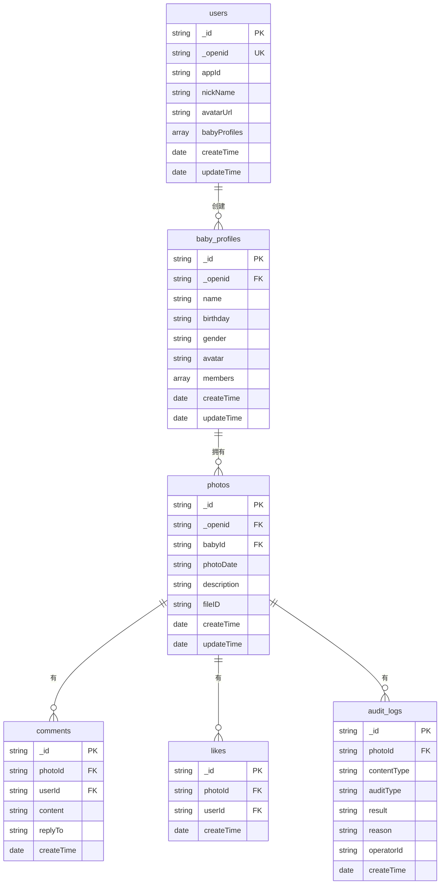

# 数据模型文档 - Baby Care Tracker

## 概述

本文档定义了 Baby Care Tracker 项目的数据库数据模型。项目使用 CloudBase 数据库（NoSQL 文档数据库），数据模型采用类似 MongoDB 的文档结构。

**数据库类型：** CloudBase 数据库（NoSQL 文档数据库）  
**环境 ID：** `neo3-7gtg0bdtc9fcc672`

---

## 1. 数据库集合列表

| 集合名称 | 功能描述 | 主要字段 |
|---------|---------|---------|
| `users` | 用户信息 | `_openid`, `appId`, `nickName`, `avatarUrl`, `babyProfiles` |
| `baby_profiles` | 宝宝档案 | `name`, `birthday`, `gender`, `avatar`, `members`, `createTime` |
| `photos` | 照片记录 | `babyId`, `photoDate`, `description`, `fileID`, `filePath`, `createTime` |
| `comments` | 评论（规划中） | `photoId`, `userId`, `content`, `createTime` |
| `likes` | 点赞（规划中） | `photoId`, `userId`, `createTime` |
| `audit_logs` | 审核日志（规划中） | `photoId`, `contentType`, `auditType`, `result`, `createTime` |

---

## 2. 集合详细定义

### 2.1 users（用户信息）

**功能：** 存储用户基本信息

**集合名称：** `users`

**字段定义：**

| 字段名 | 类型 | 必填 | 默认值 | 说明 |
|--------|------|------|--------|------|
| `_id` | String | 是 | 自动生成 | 用户 ID（CloudBase 自动生成） |
| `_openid` | String | 是 | - | 微信 OPENID（用户唯一标识） |
| `appId` | String | 是 | - | 微信小程序 AppID |
| `nickName` | String | 否 | `''` | 用户昵称 |
| `avatarUrl` | String | 否 | `''` | 用户头像 URL |
| `babyProfiles` | Array | 否 | `[]` | 宝宝档案 ID 列表 |
| `createTime` | Date | 是 | `db.serverDate()` | 创建时间 |
| `updateTime` | Date | 是 | `db.serverDate()` | 更新时间 |

**索引：**

```javascript
// 主键索引（自动创建）
{ _id: 1 }

// OPENID 唯一索引
{ _openid: 1 }, { unique: true }
```

**示例数据：**

```json
{
  "_id": "user_001",
  "_openid": "oXXXX1234567890",
  "appId": "wx1f1bc8e6ff2be61d",
  "nickName": "小明爸爸",
  "avatarUrl": "https://thirdwx.qlogo.cn/mmopen/...",
  "babyProfiles": ["bp_001", "bp_002"],
  "createTime": "2026-05-21T10:00:00.000Z",
  "updateTime": "2026-05-21T10:00:00.000Z"
}
```

---

### 2.2 baby_profiles（宝宝档案）

**功能：** 存储宝宝档案信息

**集合名称：** `baby_profiles`

**字段定义：**

| 字段名 | 类型 | 必填 | 默认值 | 说明 |
|--------|------|------|--------|------|
| `_id` | String | 是 | 自动生成 | 宝宝档案 ID |
| `_openid` | String | 是 | - | 创建者 OPENID |
| `name` | String | 是 | - | 宝宝姓名 |
| `birthday` | String | 是 | - | 出生日期（格式：`YYYY-MM-DD`） |
| `gender` | String | 是 | - | 性别：`male` / `female` / `unknown` |
| `avatar` | String | 否 | `''` | 宝宝头像 URL（CloudBase 存储） |
| `members` | Array | 是 | `[]` | 家庭成员列表 |
| `members[].userId` | String | 是 | - | 成员用户 ID（OPENID） |
| `members[].role` | String | 是 | - | 角色：`creator` / `admin` / `member` / `viewer` |
| `members[].relationship` | String | 否 | `''` | 与宝宝的关系（如：爸爸、妈妈） |
| `members[].joinTime` | Date | 是 | `new Date()` | 加入时间 |
| `createTime` | Date | 是 | `db.serverDate()` | 创建时间 |
| `updateTime` | Date | 是 | `db.serverDate()` | 更新时间 |

**索引：**

```javascript
// 主键索引（自动创建）
{ _id: 1 }

// 创建者索引
{ _openid: 1 }

// 成员用户 ID 索引（用于查询用户参与的家庭）
{ "members.userId": 1 }
```

**示例数据：**

```json
{
  "_id": "bp_001",
  "_openid": "oXXXX1234567890",
  "name": "小明",
  "birthday": "2025-10-01",
  "gender": "male",
  "avatar": "cloudbase://...",
  "members": [
    {
      "userId": "oXXXX1234567890",
      "role": "creator",
      "relationship": "爸爸",
      "joinTime": "2026-05-21T10:00:00.000Z"
    }
  ],
  "createTime": "2026-05-21T10:00:00.000Z",
  "updateTime": "2026-05-21T10:00:00.000Z"
}
```

---

### 2.3 photos（照片记录）

**功能：** 存储宝宝照片信息

**集合名称：** `photos`

**字段定义：**

| 字段名 | 类型 | 必填 | 默认值 | 说明 |
|--------|------|------|--------|------|
| `_id` | String | 是 | 自动生成 | 照片 ID |
| `_openid` | String | 是 | - | 上传者 OPENID |
| `babyId` | String | 是 | - | 关联的宝宝档案 ID |
| `photoDate` | String | 是 | - | 照片拍摄日期（格式：`YYYY-MM-DD`） |
| `description` | String | 否 | `''` | 照片描述 |
| `fileID` | String | 是 | - | CloudBase 存储文件 ID |
| `filePath` | String | 否 | `''` | 文件路径 |
| `fileSize` | Number | 否 | `0` | 文件大小（字节） |
| `width` | Number | 否 | `0` | 图片宽度（像素） |
| `height` | Number | 否 | `0` | 图片高度（像素） |
| `createTime` | Date | 是 | `db.serverDate()` | 上传时间 |
| `updateTime` | Date | 是 | `db.serverDate()` | 更新时间 |

**索引：**

```javascript
// 主键索引（自动创建）
{ _id: 1 }

// 宝宝 ID + 创建时间索引（常用查询）
{ babyId: 1, createTime: -1 }

// 上传者索引
{ _openid: 1 }

// 照片日期索引（按日期查询）
{ photoDate: -1 }
```

**示例数据：**

```json
{
  "_id": "photo_001",
  "_openid": "oXXXX1234567890",
  "babyId": "bp_001",
  "photoDate": "2026-05-21",
  "description": "宝宝第一次微笑",
  "fileID": "cloudbase://...",
  "filePath": "baby_photos/bp_001/2026/05/photo_001.jpg",
  "fileSize": 2048576,
  "width": 1920,
  "height": 1080,
  "createTime": "2026-05-21T10:00:00.000Z",
  "updateTime": "2026-05-21T10:00:00.000Z"
}
```

---

### 2.4 comments（评论）【规划中】

**功能：** 存储照片评论

**集合名称：** `comments`

**字段定义：**

| 字段名 | 类型 | 必填 | 默认值 | 说明 |
|--------|------|------|--------|------|
| `_id` | String | 是 | 自动生成 | 评论 ID |
| `photoId` | String | 是 | - | 关联的照片 ID |
| `userId` | String | 是 | - | 评论者用户 ID（OPENID） |
| `content` | String | 是 | - | 评论内容 |
| `replyTo` | String | 否 | `null` | 回复的评论 ID |
| `createTime` | Date | 是 | `db.serverDate()` | 评论时间 |

**索引：**

```javascript
// 照片 ID + 创建时间索引
{ photoId: 1, createTime: 1 }
```

---

### 2.5 likes（点赞）【规划中】

**功能：** 存储照片点赞记录

**集合名称：** `likes`

**字段定义：**

| 字段名 | 类型 | 必填 | 默认值 | 说明 |
|--------|------|------|--------|------|
| `_id` | String | 是 | 自动生成 | 点赞记录 ID |
| `photoId` | String | 是 | - | 关联的照片 ID |
| `userId` | String | 是 | - | 点赞者用户 ID（OPENID） |
| `createTime` | Date | 是 | `db.serverDate()` | 点赞时间 |

**索引：**

```javascript
// 照片 ID + 用户 ID 唯一索引（防止重复点赞）
{ photoId: 1, userId: 1 }, { unique: true }
```

---

### 2.6 audit_logs（审核日志）【规划中】

**功能：** 存储内容审核日志

**集合名称：** `audit_logs`

**字段定义：**

| 字段名 | 类型 | 必填 | 默认值 | 说明 |
|--------|------|------|--------|------|
| `_id` | String | 是 | 自动生成 | 审核日志 ID |
| `photoId` | String | 是 | - | 关联的照片 ID |
| `contentType` | String | 是 | - | 内容类型：`photo` / `comment` / `user` |
| `auditType` | String | 是 | - | 审核类型：`ai` / `manual` |
| `result` | String | 是 | - | 审核结果：`approved` / `rejected` / `uncertain` |
| `reason` | String | 否 | `''` | 拒绝原因 |
| `operatorId` | String | 是 | - | 操作人 ID（`ai_system` 或运营人员 ID） |
| `createTime` | Date | 是 | `db.serverDate()` | 审核时间 |

**索引：**

```javascript
// 照片 ID 索引
{ photoId: 1 }

// 审核结果索引
{ result: 1 }
```

---

## 3. 数据关系图



---

## 4. 数据库安全规则

### 4.1 users 集合安全规则

```javascript
{
  "read": "auth.uid == doc._id",  // 只能读取自己的信息
  "write": "auth.uid == doc._id"   // 只能修改自己的信息
}
```

### 4.2 baby_profiles 集合安全规则

```javascript
{
  "read": "doc.members.userId in [auth.uid]",  // 家庭成员可以读取
  "write": "doc._openid == auth.uid || doc.members[].userId in [auth.uid] && doc.members[].role in ['creator', 'admin']"
}
```

### 4.3 photos 集合安全规则

```javascript
{
  "read": "doc.babyId in get('users/' + auth.uid).babyProfiles",  // 只能读取自己宝宝档案的照片
  "write": "doc._openid == auth.uid || get('baby_profiles/' + doc.babyId)._openid == auth.uid"
}
```

---

## 5. 数据初始化

### 5.1 初始化脚本

项目提供了初始化脚本 `scripts/init-db.js`，用于创建集合和初始化索引。

**使用方法：**

```bash
node scripts/init-db.js
```

**初始化内容：**

1. 创建集合：`users`, `baby_profiles`, `photos`, `comments`, `likes`, `audit_logs`
2. 创建索引：各集合的常用查询索引
3. 初始化安全规则

---

## 6. 数据迁移

### 6.1 备份数据

**使用方法：**

```bash
# 备份所有集合
node scripts/backup-db.js

# 备份指定集合
node scripts/backup-db.js --collections users,baby_profiles,photos
```

**备份文件位置：** `backups/YYYY-MM-DD_HH-mm-ss/`

### 6.2 恢复数据

**使用方法：**

```bash
# 恢复所有集合
node scripts/restore-db.js --backup backups/2026-05-21_10-00-00

# 恢复指定集合
node scripts/restore-db.js --backup backups/2026-05-21_10-00-00 --collections users,baby_profiles
```

---

## 7. 数据查询示例

### 7.1 查询用户的宝宝档案

```javascript
const db = wx.cloud.database()
const _ = db.command

// 查询当前用户的宝宝档案
const result = await db.collection('baby_profiles').where({
  members: _.elemMatch({
    userId: '当前用户OPENID',
    role: _.in(['creator', 'admin', 'member', 'viewer'])
  })
}).get()
```

### 7.2 查询宝宝的照片（分页）

```javascript
const db = wx.cloud.database()

// 查询宝宝照片，按创建时间倒序，分页
const pageSize = 20
const page = 1

const result = await db.collection('photos')
  .where({ babyId: 'bp_001' })
  .orderBy('createTime', 'desc')
  .skip((page - 1) * pageSize)
  .limit(pageSize)
  .get()
```

### 7.3 统计宝宝照片数量（按月份）

```javascript
const db = wx.cloud.database()

// 聚合查询：按年月分组统计照片数量
const result = await db.collection('photos')
  .aggregate()
  .match({ babyId: 'bp_001' })
  .group({
    _id: {
      year: { $year: '$createTime' },
      month: { $month: '$createTime' }
    },
    count: { $sum: 1 }
  })
  .sort({ '_id.year': -1, '_id.month': -1 })
  .end()
```

---

**文档版本**：v1.0  
**最后更新**：2026-05-21  
**维护者**：开发团队
