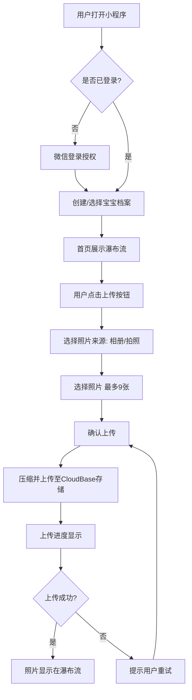
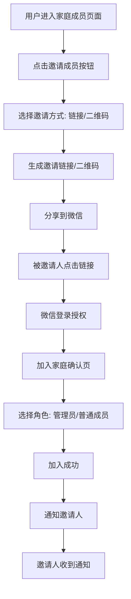

# 宝宝照片记录微信小程序 - 功能规格书（PRD）

**日期**：2026-05-21
**类型**：PRD / 功能规格书
**参与成员**：析客（需求分析师）、瑞思（用户研究员）、竞析（竞品分析师）、数析（数据分析师）、路径（路线图规划师）
**文档版本**：V1.0
**撰写人**：方向明（Fang）- 产品战略团队主理人

---

## 📌 TL;DR（执行摘要，3-5 行）

- **核心目标**：打造一款基于微信小程序的宝宝照片记录工具，专注"安全存储+家庭共享+时间轴回顾"，不做大而全
- **关键决策**：MVP v0.1极致简化（仅单用户记录），v1.0加入家庭成员共享，V2.0启动商业化（¥15-20/月会员）
- **下一步**：完成技术方案设计 → 启动MVP v0.1开发（4周）→ 内测验证核心假设

---

## 🎯 核心结论卡片

| 项目 | 内容 |
|------|------|
| 推荐方案 | 微信小程序+MVP极致简化：v0.1单用户记录验证核心价值，v1.0加入家庭共享，V2.0商业化 |
| 优先级 | P0（MVP v0.1）> P1（MVP v1.0）> P2（V1.1-V1.2增长）> P3（V2.0商业化） |
| 预期影响 | 6个月内获取1万+种子用户，次日留存>30%，激活率>60% |
| 资源需求 | 4.5人×9.6周=43.2人周（MVP阶段），累计151.2人周（全流程） |
| 风险等级 | 中（主要风险：MVP范围过大、微信审核被拒、用户隐私顾虑） |

---

## 1. 产品目标（3个清晰、正交的目标）

### 目标1：帮助用户安全、便捷地记录宝宝成长照片

**定义成功**：用户在MVP阶段完成"上传第一张照片"的激活行为比例>60%；照片上传成功率>98%

**核心指标**：
- 激活率（完成上传第一张照片的用户/新增用户）>60%
- 人均上传照片数（MVP目标：5-10张/月，V1.0目标：10-15张/月）
- 照片上传成功率>98%

**为什么这个目标重要**：宝宝照片是珍贵记忆，但用户手机相册混乱、存储压力大。我们的核心价值是帮助用户把照片从手机转移到安全的云端。

---

### 目标2：让家庭成员共同记录和回顾宝宝成长

**定义成功**：MVP v1.0阶段，平均每个宝宝档案有2+个家庭成员；家庭成员查看照片的DAU占比>40%

**核心指标**：
- 人均家庭成员数（目标：2-5人）
- 家庭成员邀请转化率（发送邀请/接受邀请）>50%
- 家庭成员DAU/总DAU >40%

**为什么这个目标重要**：宝宝成长是全家的记忆，不只是父母。家庭成员共享是差异化于竞品的关键价值（亲宝宝、时光小屋的家庭共享功能粗放）。

---

### 目标3：建立可持续的商业模式，实现产品长期价值

**定义成功**：V2.0阶段（12个月后），付费转化率>5%，ARPU>¥50/年，LTV>¥200

**核心指标**：
- 付费转化率（付费用户/总用户）>5%
- ARPU（平均每个用户年收入）>¥50/年
- LTV/CAC >3（用户生命周期价值/获取成本）

**为什么这个目标重要**：免费增值模式已被亲宝宝、时光小屋验证。我们需要在用户体验和商业化之间找到平衡，实现可持续发展。

---

## 2. 用户故事（5个核心场景）

### 用户故事1：新手妈妈记录宝宝第一次微笑

**角色**：李明华（28岁，新手妈妈，第一次当妈妈）

**场景**：
小丽在宝宝2个月大的时候，捕捉到了宝宝第一次微笑的瞬间。她想立即记录下这个珍贵的时刻，并分享给宝宝的爷爷奶奶和外公外婆。

**用户故事**：
> 作为一位新手妈妈，我希望能够**快速上传宝宝照片并添加描述**，以便**记录宝宝成长的重要时刻并与家人分享**。

**验收标准**：
- Given 小丽已登录小程序并选择了宝宝档案
- When 她点击"上传照片"按钮，选择手机相册中的照片（最多9张）
- Then 系统应允许她选择多张照片，并显示上传进度

- Given 小丽已选择照片并进入编辑页面
- When 她为照片添加描述"宝宝第一次微笑😊"和拍摄时间
- Then 系统应自动识别照片EXIF中的拍摄时间，并允许手动修改

- Given 照片已上传成功
- When 小丽查看照片详情页
- Then 她应能看到照片的大图、描述、拍摄时间、上传者信息，并可以分享给微信好友

**价值**：高 - 这是产品的核心价值主张，记录珍贵瞬间。

---

### 用户故事2：异地祖父母随时查看孙辈成长

**角色**：张秀兰（58岁，退休教师，宝宝的祖母）

**场景**：
王奶奶住在另一个城市，平时很难见到孙子。她希望通过小程序随时看到孙子的照片，感受他的成长变化。

**用户故事**：
> 作为一位祖母，我希望能够**方便地浏览孙子的所有照片并按时间查看**，以便**即使不在身边也能参与孙子的成长**。

**验收标准**：
- Given 王奶奶已通过儿子分享的链接加入家庭，并登录小程序
- When 她进入首页，看到瀑布流展示的孙子照片
- Then 她应能看到按时间倒序排列的照片，最新的在最前面

- Given 王奶奶想看宝宝百天时的照片
- When 她使用时间轴功能，滑动到3个月前的日期
- Then 系统应快速定位到该日期附近的照片，并显示该时间段的照片数量

- Given 王奶奶看到一张可爱的照片
- When 她点击照片进入详情页，并点赞或评论"宝贝真可爱！"
- Then 系统应记录她的互动，并通知照片上传者

**价值**：高 - 家庭成员共享是产品的关键差异化功能。

---

### 用户故事3：职场爸爸整理宝宝第一年成长照片

**角色**：王建国（32岁，金融行业，宝宝的父亲）

**场景**：
宝宝快满1岁了，大明想整理宝宝第一年的成长照片，找出每个月最有代表性的照片，制作一个成长回顾。

**用户故事**：
> 作为一位父亲，我希望能够**按月份浏览宝宝照片并筛选出精选照片**，以便**制作宝宝的成长回顾和纪念**。

**验收标准**：
- Given 大明已进入照片分类页面
- When 他选择"按时间分类"，看到每个月的照片数量统计
- Then 他应能看到12个月的卡片，每个卡片显示月份和照片数量

- Given 大明点击"第3月"，想看宝宝3个月时的照片
- When 系统展示3月份的所有照片（瀑布流或网格）
- Then 他应能看到照片按日期分组，每组有日期标题

- Given 大明找到一张特别喜欢的照片
- When 他长按照片，选择"设为精选"
- Then 系统应将照片标记为精选，并在成长回顾中优先展示

**价值**：中高 - 这是提升用户粘性和产品价值的重要功能。

---

### 用户故事4：妈妈管理家庭成员和隐私设置

**角色**：刘小芳（26岁，全职妈妈，宝宝的主要监护人）

**场景**：
小芳创建了宝宝的小程序账户，并邀请了丈夫、父母、公婆作为家庭成员。但她不想让某些远房亲戚看到宝宝的全部照片，想设置一些隐私限制。

**用户故事**：
> 作为一位母亲和账户创建者，我希望能够**管理家庭成员权限并设置照片可见范围**，以便**保护宝宝隐私同时让家人分享喜悦**。

**验收标准**：
- Given 小芳是宝宝档案的创建者（管理员）
- When 她进入"家庭成员"页面
- Then 她应能看到所有家庭成员列表，每个成员的角色和加入时间

- Given 小芳想邀请大姑姐加入
- When 她点击"邀请成员"，生成邀请链接或二维码
- Then 系统应允许她设置新成员的默认角色（普通成员或管理员）

- Given 小芳不想让某些成员看到宝宝洗澡的照片
- When 她为某些照片设置"仅管理员可见"
- Then 普通成员查看这些照片时应看到"无权限查看"提示

**价值**：中 - 隐私和权限管理是建立用户信任的重要功能。

---

### 用户故事5：运营人员监控内容安全

**角色**：张小明（25岁，内容运营专员）

**场景**：
小张负责小程序的内容安全监管工作。她需要每天审核用户举报的照片，处理违规内容，确保平台内容健康。

**用户故事**：
> 作为内容运营人员，我希望能够**高效审核用户举报内容和监控违规照片**，以便**维护平台内容质量和安全**。

**验收标准**：
- Given 小张登录Web运营后台
- When 她进入"内容审核"页面
- Then 她应能看到待审核的照片列表，按举报时间排序

- Given 小张正在审核一张被举报的照片
- When 她查看照片详情和用户举报理由
- Then 她应能看到照片原图、举报人信息、举报理由，并可以做出"通过"或"删除"决定

- Given 小张认为照片违规
- When 她点击"删除"并填写违规原因
- Then 系统应删除照片、通知上传者违规原因，并记录操作日志

**价值**：中 - 内容安全是平台合规运营的必要条件。

---

## 3. 用户研究洞察（来自瑞思）

### 3.1 目标用户画像（Personas）

#### Persona 1: 新手妈妈 - 李明华

- **基本信息**：28岁，一线城市，互联网公司产品经理，宝宝6个月
- **技术水平**：高，日常使用多种APP
- **痛点**：手机相册3000+张照片找不到、分享给家人需反复发微信、担心照片丢失
- **需求**：快速上传分类、一键分享、永久保存不占空间
- **使用场景**：每天多次打开，宝宝睡觉后整理照片
- **对产品期望**：简洁、流畅、温馨，让她愿意持续使用

#### Persona 2: 职场爸爸 - 王建国

- **基本信息**：32岁，二线城市，金融行业，宝宝1岁，二胎即将出生
- **技术水平**：中，主要用微信和办公软件
- **痛点**：大宝照片散落多设备、工作忙没时间整理、总忘记记录
- **需求**：批量上传自动分类、简单易用、快速找照片
- **使用场景**：周末或晚上偶尔使用，主要浏览回忆
- **对产品期望**：不复杂、不费时，能快速找到想看的照片

#### Persona 3: 祖母 - 张秀兰

- **基本信息**：58岁，已退休，帮忙带孙子，主要用微信和家人视频
- **技术水平**：低，只会基本微信操作
- **痛点**：想看孙子照片不知道怎么找、想分享给亲戚不会操作、担心点错删除
- **需求**：界面简单字体大、只能看和点赞、新照片提醒
- **使用场景**：每天早上晚上各看一次，主要浏览点赞
- **对产品期望**：操作简单、字要大、不要复杂功能

---

### 3.2 用户痛点（按严重程度排序）

1. **照片管理混乱** ⭐⭐⭐⭐⭐
   - 表现：手机相册几千张照片混在一起
   - 影响：高 - 无法快速回顾
   - 频率：每天发生

2. **存储压力** ⭐⭐⭐⭐⭐
   - 表现：宝宝照片占用大量空间，手机经常提示不足
   - 影响：高 - 迫使用户删除或购买云存储
   - 频率：持续存在

3. **分享不便** ⭐⭐⭐⭐
   - 表现：想分享需反复发送，群聊信息被刷掉
   - 影响：中高 - 影响家庭互动
   - 频率：每周多次

4. **隐私安全担忧** ⭐⭐⭐
   - 表现：担心照片泄露，不愿用第三方云存储
   - 影响：中 - 影响付费意愿
   - 频率：偶尔但持续

5. **回忆检索困难** ⭐⭐⭐
   - 表现：想找某个月照片很麻烦
   - 影响：中 - 影响情感体验
   - 频率：每月几次

---

### 3.3 用户偏好总结

| 维度 | 用户偏好 | 设计启示 |
|------|---------|---------|
| 界面风格 | 简洁、温馨、可爱 | 柔和色彩，宝宝元素 |
| 交互方式 | 少点击、大按钮、手势 | 优化路径，支持手势 |
| 内容呈现 | 照片为主，文字为辅 | 瀑布流，减少文字 |
| 通知策略 | 重要但不能太频繁 | 智能通知，可自定义 |
| 付费意愿 | 基础免费，增值付费 | 免费+付费扩容 |
| 社交需求 | 希望互动但不想太公开 | 家庭内部，不公开 |
| 隐私要求 | 不能泄露但不能太复杂 | 简洁权限，默认共享 |

---

### 3.4 用户研究启示

1. **MVP必须极致简化**：用户（尤其是爸爸和祖母）没有耐心完成复杂引导流程
2. **时间轴是核心功能**：所有用户都希望通过时间快速定位照片
3. **隐私是用户核心关切**：妈妈用户群尤其关心，必须在产品设计中突出安全保障
4. **家庭成员共享是差异化机会**：爸爸和祖母都希望更便捷的共享方式，竞品做得不够好

---

## 4. 竞品对比（来自竞析，6个产品）

### 4.1 竞品全景图

| 产品 | 平台 | 核心定位 | 月活(估算) | 会员价格 |
|------|------|---------|-----------|---------|
| 亲宝宝 | 独立APP | 宝宝成长记录+育儿知识 | ~500万 | ¥20-35/月 |
| 时光小屋 | 独立APP | 家庭云存储+时间轴 | ~200万 | ¥15.7/月 |
| 宝宝树小时光 | 独立APP | 社交记录+早教内容 | ~750万 | 待定 |
| 口袋宝宝 | 独立APP | 晒娃+智能整理 | ~50万 | 待定 |
| 时光宝宝相册 | 微信小程序+APP | 家人记录宝宝成长 | ~10万 | 待定 |
| 萌娃相册 | 微信小程序 | 极简宝宝相册 | ~5万 | 待定 |

---

### 4.2 功能对比矩阵

| 功能维度 | 我们的产品（规划） | 亲宝宝 | 时光小屋 | 宝宝树小时光 | 时光宝宝相册 | 萌娃相册 |
|---------|-----------------|--------|---------|------------|---------------|---------|
| **平台形式** | 微信小程序+Web后台 | 独立APP | 独立APP | 独立APP | 小程序+APP | 小程序 |
| **照片上传** | ✅ | ✅ | ✅ | ✅ | ✅ | ✅ |
| **原图存储** | ✅（规划） | ✅（会员） | ✅（VIP） | ✅ | ✅ | ❌ |
| **时间轴展示** | ✅（规划） | ✅ | ✅ | ✅ | ❌ | ❌ |
| **家庭成员共享** | ✅（规划） | ✅ | ✅ | ✅ | ✅ | ✅ |
| **权限管理** | ✅（规划，RBAC） | ⚠️（粗放） | ✅（四级） | ⚠️（粗放） | ⚠️（简单） | ❌ |
| **微信登录** | ✅（规划） | ❌ | ❌ | ❌ | ✅ | ✅ |
| **无需下载APP** | ✅（小程序） | ❌ | ❌ | ❌ | ✅（小程序） | ✅ |
| **AI识别** | ⚠️（规划V1.1） | ✅ | ⚠️ | ⚠️ | ❌ | ❌ |
| **Web运营后台** | ✅（规划V1.0） | ❌ | ❌ | ❌ | ❌ | ❌ |
| **免费存储** | ✅（规划） | ⚠️（限量） | ⚠️（压缩） | ✅（不限量） | ⚠️ | ✅（有限） |

---

### 4.3 市场空白和差异化机会

#### 市场空白

1. **微信小程序赛道的轻量级解决方案**
   - 头部应用均为独立APP，需要下载安装
   - 现有微信小程序功能简单，缺乏差异化
   - **机会**：无需下载APP，微信内直接使用，降低用户门槛

2. **家庭成员权限管理的精细化**
   - 大部分应用权限管理粗放（仅"家人"和"粉丝"两类）
   - **机会**：多角色权限（创建者、管理员、普通成员、仅查看者）

3. **Web运营后台的缺失**
   - 现有应用均为移动端，缺乏Web端管理能力
   - **机会**：Web运营后台，批量上传、批量下载、数据分析

#### 差异化机会

1. **"微信原生"体验**
   - 微信登录、微信分享、微信支付、微信通知
   - 降低用户学习成本，符合中国用户习惯

2. **"极简专注"定位**
   - 专注照片记录，不做育儿知识、社区圈子等"大而全"功能
   - 界面极简，核心操作流程3步完成

3. **"隐私优先"设计**
   - 端到端加密，私密分享，数据自主权
   - 吸引高隐私意识用户

---

### 4.4 SWOT分析

#### Strengths（优势）

- 微信小程序载体，无需下载，门槛低
- 专注"记录+共享"，不做大而全
- 技术栈现代（CloudBase+云开发），快速迭代

#### Weaknesses（劣势）

- 品牌知名度为零，需从零开始
- 独立APP功能更丰富（亲宝宝、时光小屋）
- 小程序技术受限（包大小、API能力）

#### Opportunities（机会）

- 微信小程序赛道存在市场空白
- 家庭成员协作是未被充分满足的需求
- 商业化模式（免费增值）已被验证

#### Threats（威胁）

- 亲宝宝、宝宝树等头部应用资金雄厚
- 微信小程序审核政策风险
- 用户隐私顾虑可能影响增长

---

### 4.5 差异化机会总结

**核心差异化定位**：
> "微信生态原生的宝宝照片记录工具，专注家庭共享，极简不做大而全"

**支撑点**：
1. 微信小程序载体（无需下载APP）
2. 家庭成员精细权限管理（RBAC）
3. Web运营后台（竞品缺失）
4. 极简专注的产品定位（不做育儿社区）

---

## 5. 数据依据（来自数析）

### 5.1 核心指标框架（HEART）

#### H - Happiness（用户满意度）

| 指标名称 | 定义 | 目标基准 | 追踪频率 |
|---------|------|---------|---------|
| NPS (Net Promoter Score) | 用户推荐意愿 | >40 (行业优秀) | 季度 |
| CSAT (Customer Satisfaction) | 用户满意度 | >4.2/5.0 | 月度 |
| 功能满意度评分 | 各核心功能的满意度 | >4.0/5.0 | 月度 |

#### E - Engagement（用户参与度）

| 指标名称 | 定义 | 目标基准 | 追踪频率 |
|---------|------|---------|---------|
| DAU (日活跃用户数) | 每日启动小程序的独立用户数 | - | 每日 |
| DAU/MAU (用户粘性) | 日活/月活比例 | >20% (良好)>25% (优秀) | 每周 |
| 人均上传照片数 | 平均每个用户上传的照片数量 | 15-30张/月 | 每周 |
| 人均浏览照片数 | 平均每个用户浏览的照片数量 | 50-100张/月 | 每周 |
| 家庭成员邀请数 | 邀请的家庭成员总数 | - | 每周 |

#### A - Adoption（用户采用率）

| 指标名称 | 定义 | 目标基准 | 追踪频率 |
|---------|------|---------|---------|
| 新增用户数 | 每日/每周/每月首次使用小程序的用户数 | - | 每日 |
| 激活率 | 完成核心行为的用户比例 | >60% | 每周 |
| 首次上传时长 | 从注册到首次上传照片的平均时长 | <10分钟 | 每周 |

#### R - Retention（用户留存率）

| 指标名称 | 定义 | 目标基准 | 追踪频率 |
|---------|------|---------|---------|
| 次日留存率 (D1) | 新增用户次日仍活跃的比例 | >30% (良好) | 每日 |
| 7日留存率 (D7) | 新增用户7日后仍活跃的比例 | >15% (良好)>25% (优秀) | 每周 |
| 30日留存率 (D30) | 新增用户30日后仍活跃的比例 | >15% (良好)>25% (优秀) | 每月 |
| 长期留存率 (D90) | 长期用户的留存情况 | >12% | 每季度 |

#### T - Task Success（任务完成度）

| 指标名称 | 定义 | 目标基准 | 追踪频率 |
|---------|------|---------|---------|
| 照片上传成功率 | 照片上传成功的百分比 | >98% | 每日 |
| 照片加载成功率 | 照片成功加载的百分比 | >99% | 每日 |
| 核心漏斗转化率 | 关键用户路径的转化情况 | - | 每周 |

---

### 5.2 成功指标（分阶段）

#### 阶段一（0-3月）：产品验证期

| 指标 | 目标值 | 说明 |
|-----|--------|------|
| 新增用户数 | 500-1000人/月 | 通过小范围推广获取种子用户 |
| 激活率 | >60% | 验证登录流程是否顺畅 |
| 次日留存率 | >30% | 验证产品是否有初步吸引力 |
| 7日留存率 | >15% | 验证产品是否能留住用户 |
| NPS | >20 | 初步验证用户满意度 |

#### 阶段二（3-6月）：增长验证期

| 指标 | 目标值 | 说明 |
|-----|--------|------|
| 新增用户数 | 2000-5000人/月 | 扩大推广力度 |
| 激活率 | >60% | 优化新用户引导 |
| 次日留存率 | >30% | 提升产品吸引力 |
| K因子（病毒系数） | >0.5 | 每个用户平均邀请0.5个新用户 |
| CAC（用户获取成本） | <¥20 | 控制推广成本 |

#### 阶段三（6-12月）：规模化增长期

| 指标 | 目标值 | 说明 |
|-----|--------|------|
| MAU | 5-10万 | 达到规模化基础 |
| DAU/MAU | >20% | 建立用户习惯 |
| 30日留存率 | >20% | 形成稳定用户基础 |
| LTV | >¥100 | 用户生命周期价值 |

#### 阶段四（12月+）：商业化期

| 指标 | 目标值 | 说明 |
|-----|--------|------|
| 付费用户数 | >1万 | 建立付费用户基础 |
| 付费转化率 | >5% | 免费到付费的转化 |
| ARPU | >¥50/年 | 平均每个用户的年收入 |
| LTV | >¥200 | 用户生命周期价值提升 |

---

### 5.3 行业基准数据

#### 微信小程序行业基准

| 指标 | 行业平均 | 良好水平 | 优秀水平 |
|-----|---------|---------|---------|
| 次日留存率 | 15-20% | 20-30% | >40% |
| 7日留存率 | 3.2-15% | 15-20% | >30% |
| 30日留存率 | 5-10% | 10-15% | >20% |

#### 照片/相册类应用基准

| 指标 | 亲宝宝 | 行业平均 |
|-----|--------|---------|
| 次日留存率 | ~25% | 20-30% |
| 7日留存率 | ~18% | 15-20% |
| 人均上传照片/月 | 20-30张 | 10-20张 |

---

### 5.4 数据验证需求（待验证假设）

⚠️ **以下功能的优先级依赖于数据验证结果。验证完成后需更新本文档。**

1. **假设H1**：目标用户是0-3岁宝宝父母，占比>70%
   - 验证方法：问卷调研（300+样本），或分析竞品用户画像数据
   - 影响功能：功能1（微信登录）、功能2（创建宝宝档案）

2. **假设H4**：平均每个宝宝档案有3-5个家庭成员
   - 验证方法：问卷调研，或分析时光宝宝相册等竞品的公开数据
   - 影响功能：功能8（家庭成员管理）、功能9（权限管理）

3. **假设H11**：市场缺乏专注宝宝照片记录的小程序（机会大于竞争）
   - 验证方法：微信小程序搜索"宝宝照片"关键词，分析搜索量和现有小程序MAU
   - 影响功能：功能3（照片上传）、功能4（照片浏览）

4. **假设H12**：用户对价格敏感度中等，愿意为存储和纪念付费
   - 验证方法：问卷测试不同价格点（¥10/15/20/30每月）的付费意愿
   - 影响功能：功能10（照片下载）、功能20（AI深度应用）

5. **假设H13**：宝宝照片记录是长期需求（0-6岁），用户生命周期价值高
   - 验证方法：分析亲宝宝等竞品的用户留存曲线，看是否长期使用
   - 影响功能：功能5（按时间分类）、功能17（成长记录）

---

## 6. 需求池（P0/P1/P2/P3 优先级）

### P0 - MVP v0.1（4周，极致简化）

**核心目标**：验证核心假设（用户是否愿意用小程序记录宝宝照片？）

| 编号 | 需求 | 优先级 | 验收标准 | 估算工作量 |
|------|------|--------|---------|---------|
| P0-1 | 微信一键登录 | P0 | 用户点击授权后3秒内完成登录，登录态保持7天 | 2人天 |
| P0-2 | 创建宝宝档案（单宝宝） | P0 | 用户填写姓名+生日+性别后，系统创建档案并跳转首页 | 3人天 |
| P0-3 | 照片上传（压缩+进度显示） | P0 | 上传成功率>98%，9张照片上传时间<30秒（WiFi） | 5人天 |
| P0-4 | 照片浏览（瀑布流） | P0 | 瀑布流滚动帧率>50fps，点击照片1秒内打开大图 | 4人天 |
| P0-5 | 按时间分类（年/月/日） | P0 | 用户点击某月份，2秒内展示该月照片 | 3人天 |
| P0-6 | CloudBase后端 + CloudBase存储（最小可用） | P0 | API响应时间<500ms，照片上传成功率>98% | 5人天 |
| P0-7 | 内容审核（AI自动，CloudBase内容安全） | P0 | AI审核覆盖率100%，误判率<5% | 3人天 |

**P0总计**：7个功能，25人天（约5人周）

**不包含（留给v1.0）**：
- 家庭成员管理
- 照片下载
- 按地点分类
- 照片删除
- 用户反馈

---

### P1 - MVP v1.0（4周，完整体验）

**核心目标**：功能完整，准备公开发布，验证家庭成员协作价值

| 编号 | 需求 | 优先级 | 验收标准 | 估算工作量 |
|------|------|--------|---------|---------|
| P1-1 | 家庭成员管理（邀请+列表+角色） | P1 | 邀请转化率>50%，成员列表加载<1秒 | 5人天 |
| P1-2 | 权限管理（简化版RBAC） | P1 | 越权操作拦截率100%，权限变更实时生效 | 4人天 |
| P1-3 | 照片下载（保存到相册+原图/压缩图） | P1 | 下载成功率>95%，原图下载时间<5秒 | 3人天 |
| P1-4 | 照片删除（权限控制+回收站） | P1 | 删除后30天内可恢复，回收站列表加载<2秒 | 3人天 |
| P1-5 | 按地点分类（EXIF或手动标注） | P1 | 地点标签创建成功率>98%，地点筛选响应<1秒 | 4人天 |
| P1-6 | 用户反馈机制 | P1 | 反馈提交成功率>99%，反馈状态跟踪准确 | 2人天 |
| P1-7 | Web运营后台（简化版） | P1 | 审核队列加载<2秒，批量操作支持>10条 | 6人天 |

**P1总计**：7个功能，27人天（约5.4人周）

---

### P2 - V1.1-V1.2（8周，增长与留存）

**核心目标**：提升用户留存和活跃，准备商业化探索

| 编号 | 需求 | 优先级 | 验收标准 | 估算工作量 |
|------|------|--------|---------|---------|
| P2-1 | 照片增强（标签、收藏、分享、批量操作） | P2 | 标签创建成功率>98%，分享到微信成功率>95% | 5人天 |
| P2-2 | 智能分类与搜索（AI分类、全文搜索） | P2 | 搜索响应时间<1秒，AI识别准确率>90% | 8人天 |
| P2-3 | 成长记录（里程碑、时间线、曲线图） | P2 | 时间线加载<2秒，里程碑创建成功率>99% | 6人天 |
| P2-4 | 通知与互动（推送、评论、点赞） | P2 | 推送到达率>80%，评论加载<1秒 | 5人天 |
| P2-5 | Web运营后台增强（数据统计、反馈管理） | P2 | 数据看板加载<3秒，报表导出成功率>99% | 6人天 |

**P2总计**：5个功能，30人天（约6人周）

---

### P3 - V2.0（12周，差异化与商业化）

**核心目标**：打造差异化竞争力，实现商业变现

| 编号 | 需求 | 优先级 | 验收标准 | 估算工作量 |
|------|------|--------|---------|---------|
| P3-1 | AI深度应用（美颜、智能推荐、成长预测） | P3 | AI处理时间<5秒，推荐准确率>85% | 10人天 |
| P3-2 | 社交功能（育儿圈子、专家问答） | P3 | 圈子加载<2秒，问答回复率>50% | 12人天 |
| P3-3 | 实体产品（照片书、打印服务） | P3 | 照片书生成时间<10秒，订单创建成功率>99% | 8人天 |
| P3-4 | 会员订阅（付费方案、支付集成） | P3 | 支付成功率>98%，会员权限实时生效 | 8人天 |

**P3总计**：4个功能，38人天（约7.6人周）

---

### 需求池总览

| 优先级 | 功能数量 | 开发周期 | 核心目标 | 估算工作量 |
|--------|----------|----------|----------|---------|
| P0 | 7个 | 4.8周 | MVP上线，验证核心假设 | 25人天（5人周） |
| P1 | 7个 | 4.8周 | 功能完整，公测准备 | 27人天（5.4人周） |
| P2 | 5个 | 9.6周 | 提升留存，准备商业化 | 30人天（6人周） |
| P3 | 4个 | 14.4周 | 差异化功能，探索新增长 | 38人天（7.6人周） |
| **总计** | **23个** | **33.6周** | **全流程** | **120人天（24人周）** |

**注意**：以上估算工作量仅为前端+后端开发工作量，未包含设计、测试、部署等时间。实际项目需要×2-2.5的系数。

---

## 7. 关键流程图 / UI 设计稿

### 7.1 核心用户流程：照片上传



---

### 7.2 核心用户流程：家庭成员邀请



---

### 7.3 信息架构（IA）

```
首页
├── 瀑布流（照片浏览）
│   ├── 顶部：时间轴筛选（年/月/日）
│   ├── 照片卡片（缩略图+时间）
│   └── 点击→照片详情页
├── 上传（Tab）
│   └── 上传流程（选择照片→确认→上传）
├── 消息（Tab）
│   └── 通知列表（新照片/评论/点赞）
└── 我的（Tab）
    ├── 宝宝档案
    ├── 家庭成员（P1）
    ├── 我的收藏（P2）
    ├── 设置
    │   ├── 账号管理
    │   ├── 隐私设置
    │   └── 回收站（P1）
    └── 反馈帮助
```

---

### 7.4 UI设计原则

1. **简洁优先**：每个页面只做一件事，避免功能堆砌
2. **照片为主**：界面70%面积是照片，文字和按钮最小化
3. **温馨色调**：主色调用暖色（如#FF6B6B），辅色调用柔和色（如#FFE66D）
4. **大点击区域**：按钮最小44×44pt，方便拇指操作
5. **流畅动画**：页面转场0.3秒，照片加载用渐显动画

---

## 8. Non-goals（明确不做什么）

### 8.1 明确不做的功能（MVP阶段）

1. **❌ 不做育儿知识/社区圈子**
   - 理由：亲宝宝、宝宝树已做得很好，我们专注"记录+共享"
   - 影响：避免功能繁杂，保持产品极简定位

2. **❌ 不做独立APP（MVP和V1.0）**
   - 理由：微信小程序已能满足需求，独立APP增加开发和推广成本
   - 影响：用户需下载，门槛高；但小程序足够用

3. **❌ 不做视频录制/编辑（MVP和V1.0）**
   - 理由：聚焦照片记录，视频会增加存储和复杂度
   - 影响：部分用户可能希望录视频；V2.0可考虑

4. **❌ 不做多宝宝切换（MVP v0.1）**
   - 理由：极致简化，先验证单宝宝场景
   - 影响：多孩家庭需创建多个账号；v1.0支持多宝宝

5. **❌ 不做AI人脸识别/场景识别（MVP和V1.0）**
   - 理由：AI增加成本和复杂度，MVP先验证核心价值
   - 影响：用户需手动分类；V1.1加入AI功能

---

### 8.2 明确不做的业务决策

1. **❌ 不先做iOS/Android APP**
   - 决策：优先微信小程序，用户量起来后再考虑APP
   - 理由：小程序开发成本低、传播快

2. **❌ 不接入第三方广告（MVP和V1.0）**
   - 决策：保持界面纯净，不做广告变现
   - 理由：广告伤害用户体验，影响口碑

3. **❌ 不开放API/平台化（MVP/V1.0/V1.1/V1.2）**
   - 决策：专注自有产品，不开放API
   - 理由：平台化增加复杂度，分散精力

4. **❌ 不自建后端服务器**
   - 决策：完全基于CloudBase云开发，不搭建自有服务器
   - 理由：CloudBase提供完整的后端能力（云函数、数据库、存储、鉴权），无需自建后端

---

## 9. 时间线 & 里程碑（来自路径）

### 9.1 开发阶段划分

| 阶段 | 时间 | 核心目标 | 关键交付物 |
|------|------|---------|---------|
| **阶段0：MVP v0.1** | 4.8周 | 核心记录功能上线 | MVP小程序、内测反馈 |
| **阶段1：MVP v1.0** | 4.8周 | 完整产品体验 | 正式小程序、Web后台 |
| **阶段2：V1.1-V1.2** | 9.6周 | 增长与留存 | V1.1/V1.2小程序、数据看板 |
| **阶段3：V2.0** | 14.4周 | 差异化与商业化 | V2.0小程序、会员系统 |

**累计开发时间**：33.6周（约8.5个月）+ 审核和发布时间 = 9-10个月

---

### 9.2 关键里程碑（Milestone）

| 里程碑 | 时间 | 交付物 | 成功标准 |
|--------|------|--------|----------|
| **M0: PRD完成** | 第0周末 | PRD V1.0 | 产品需求确定 |
| **M1: MVP v0.1完成** | 第4.8周末 | MVP小程序、内测反馈 | 核心功能可运行，内测留存率>30% |
| **M2: MVP v1.0完成** | 第9.6周末 | MVP小程序+Web后台 | 通过微信审核，公测留存率>40% |
| **M3: 正式版上线** | 第11.6周末 | 正式小程序、运营材料 | 成功发布，DAU>500 |
| **M4: 增长阶段完成** | 第30.8周末 | V1.1-V1.2小程序、数据看板 | 留存提升，DAU>2000 |
| **M5: V2.0版本发布** | 第45.2周末 | V2.0小程序、会员系统 | 付费转化率>5%，ARPU>¥50/年 |

---

### 9.3 发布节奏

| 版本 | 发布时间 | 核心特性 | 目标 |
|------|----------|----------|------|
| **V0.1 Alpha** | 第7.2周末 | MVP核心功能（无家庭成员） | 内部验证+内测 |
| **V1.0 Beta** | 第12周末 | MVP完整功能（含家庭成员） | 公测 |
| **V1.0 正式版** | 第14周末 | 完整产品体验+通过审核 | 公开发布 |
| **V1.1 增长版** | 第23.6周末 | 照片增强+智能分类 | 提升留存 |
| **V1.2 留存版** | 第33.2周末 | 成长记录+通知互动 | 提升活跃 |
| **V2.0 商业化版** | 第47.6周末 | AI功能+社交+会员 | 商业变现 |

---

## 10. 待确认问题

### 10.1 需数据验证的问题（高优先级）

1. **❓ 假设H1：目标用户是0-3岁宝宝父母，占比>70%**
   - 待验证：问卷调研或竞品数据分析
   - 影响：如果验证失败（用户年龄分布更广），需调整产品定位

2. **❓ 假设H4：平均每个宝宝档案有3-5个家庭成员**
   - 待验证：问卷调研或竞品数据分析
   - 影响：如果验证失败（平均仅1-2人），家庭成员功能优先级降低

3. **❓ 假设H11：市场缺乏专注宝宝照片记录的小程序**
   - 待验证：微信小程序搜索数据分析
   - 影响：如果验证失败（竞争激烈），需重新定位差异化

4. **❓ 假设H12：用户愿意为存储和纪念付费**
   - 待验证：问卷测试付费意愿
   - 影响：如果验证失败（付费意愿低），需调整商业模式

5. **❓ 假设H13：宝宝照片记录是长期需求（0-6岁）**
   - 待验证：竞品用户留存数据分析
   - 影响：如果验证失败（用户使用时间短），LTV计算需调整

---

### 10.2 需技术验证的问题（中优先级）

1. **❓ CloudBase能否支持MVP阶段的性能和成本需求？**
   - 待验证：技术POC，压力测试
   - 影响：如果性能或成本有挑战，需优化CloudBase使用策略（如缓存策略、CDN加速、数据库索引优化、云函数冷启动优化）

2. **❓ 微信小程序能否支持我们的产品需求（如后台下载、推送通知）？**
   - 待验证：技术POC，微信API能力测试
   - 影响：如果小程序能力受限，需调整产品方案或做独立APP

3. **❓ CloudBase内容审核的准确率和成本如何？**
   - 待验证：接入测试，抽样验证准确率
   - 影响：如果误判率高，需增加人工审核；如果成本高，需优化策略

---

### 10.3 需设计决策的问题（中优先级）

1. **❓ MVP v0.1的UI/UX设计风格？**
   - 待决策：设计师提供3个设计方案，团队评审
   - 影响：设计风格影响用户第一印象和品牌认知

2. **❓ 照片压缩策略：JPEG vs WebP？质量参数？**
   - 待决策：A/B测试，对比加载速度和画质
   - 影响：压缩策略影响存储成本、流量成本和用户体验

3. **❓ 默认权限设置：公开 vs 仅家庭成员可见？**
   - 待决策：用户研究显示隐私是核心关切，建议默认"仅家庭成员可见"
   - 影响：默认权限影响用户隐私感知和产品口碑

---

## ✅ 行动清单

| # | 行动 | 负责方 | 时间窗 |
|---|------|--------|--------|
| 1 | 完成技术方案设计（CloudBase架构、CloudBase存储方案、数据库设计） | 技术负责人 | Week 1-2 |
| 2 | 完成UI/UX设计（wireframe + prototype） | UI/UX设计师 | Week 1-2 |
| 3 | 启动MVP v0.1开发（前端+后端+测试） | 开发团队 | Week 3-7 |
| 4 | 内测用户招募（50-100人） | 运营团队 | Week 6-7 |
| 5 | MVP v0.1内测发布 | 产品+运营 | Week 7 |
| 6 | 收集内测反馈，准备MVP v1.0需求调整 | 产品负责人 | Week 8-9 |
| 7 | 数据验证（H1/H4/H11/H12/H13） | 数据分析师 | Week 2-4 |

---

## ⚠️ 待确认 / 假设 / Non-goals

### 待确认

- [ ] 假设H1/H4/H11/H12/H13的验证结果
- [ ] 技术方案评审结论（CloudBase架构方案）
- [ ] UI/UX设计方案评审结论
- [ ] 微信小程序审核政策风险应对方案

### 假设（需验证）

- H1：目标用户是0-3岁宝宝父母，占比>70% ⚠️ 待验证
- H4：平均每个宝宝档案有3-5个家庭成员 ⚠️ 待验证
- H11：市场缺乏专注宝宝照片记录的小程序 ⚠️ 待验证
- H12：用户愿意为存储和纪念付费 ⚠️ 待验证
- H13：宝宝照片记录是长期需求（0-6岁） ⚠️ 待验证

### Non-goals（明确不做什么）

- ❌ 不做育儿知识/社区圈子（MVP/V1.0/V1.1/V1.2）
- ❌ 不做独立APP（MVP/V1.0）
- ❌ 不做视频录制/编辑（MVP/V1.0）
- ❌ 不做多宝宝切换（MVP v0.1）
- ❌ 不做AI人脸识别/场景识别（MVP/V1.0）
- ❌ 不先做iOS/Android APP
- ❌ 不接入第三方广告（MVP/V1.0）
- ❌ 不开放API/平台化（MVP/V1.0/V1.1/V1.2）

---

## 📚 数据来源 & 成员产出索引

- **析客（需求分析师）**：需求分析头脑风暴报告、功能概述清单（23个功能）
- **瑞思（用户研究员）**：用户研究头脑风暴报告（3个Persona、5个痛点、用户偏好）
- **竞析（竞品分析师）**：竞品分析头脑风暴报告（6个竞品、SWOT、差异化机会）
- **数析（数据分析师）**：数据指标头脑风暴报告（HEART框架、成功指标、A/B测试方案）
- **路径（路线图规划师）**：路线图规划头脑风暴报告（5个阶段、里程碑、资源评估）

---

> **本报告由产品战略团队 AI 协作生成，重要决策请由产品负责人审定。**
>
> **报告版本**：V1.0（2026-05-21）
> **下一步**：技术方案设计 → MVP开发启动 → 内测验证
